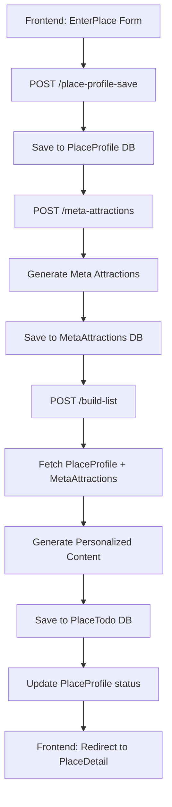

# Place Profile Architecture

## 🎯 **Core Concept: Profile Slug as Master Index + Separate Collections**

The **profile slug** is the DNA that everything indexes off of. Each section gets its **own collection** and the **parser organizes** them.

### **Profile Slug Examples:**
- `ParisBudgetSolo` → Paris, Budget, Solo traveler
- `TokyoLuxuryFamily` → Tokyo, Luxury, Family with kids  
- `LondonMidRangeFriends` → London, Mid-range, Friends group
- `BarcelonaAdventureCouple` → Barcelona, Adventure, Couple

---

## 🏗️ **Modular Service Architecture**

### **Step 1: Place Profile Save**
**Endpoint:** `POST /tripwell/place-profile-save`
**Purpose:** Save the initial place + profile data
**Database:** `PlaceProfile` collection
**Status:** `profile_saved`

```javascript
// Input
{
  "placeSlug": "ParisBudgetSolo",
  "inputVariables": {
    "city": "Paris",
    "season": "Spring", 
    "purpose": "Cultural exploration",
    "whoWith": "solo",
    "priorities": ["Culture & History", "Food & Dining"],
    "vibes": ["Authentic & Local", "Adventurous & Active"],
    "mobility": ["Love walking everywhere"],
    "travelPace": ["Moderate - Balanced activities"],
    "budget": "Budget ($50-100/day)"
  }
}

// Output
{
  "status": "success",
  "placeSlug": "ParisBudgetSolo",
  "placeProfileId": "64f8a1b2c3d4e5f6a7b8c9d0",
  "nextStep": "Call meta attractions service"
}
```

### **Step 2: Meta Attractions Generation**
**Endpoint:** `POST /tripwell/meta-attractions`
**Purpose:** Generate obvious tourist traps to avoid
**Database:** `MetaAttractions` collection
**Status:** `meta_generated`

```javascript
// Input
{
  "placeSlug": "ParisBudgetSolo",
  "city": "Paris",
  "season": "Spring"
}

// Output
{
  "status": "success",
  "placeSlug": "ParisBudgetSolo",
  "metaAttractionsId": "64f8a1b2c3d4e5f6a7b8c9d1",
  "metaAttractions": [
    {
      "name": "Eiffel Tower",
      "type": "landmark", 
      "reason": "Most iconic symbol of the city"
    },
    {
      "name": "Louvre Museum",
      "type": "museum",
      "reason": "World's largest art museum"
    }
    // ... more obvious tourist traps
  ],
  "nextStep": "Call build list service"
}
```

### **Step 3: Build List Service**
**Endpoint:** `POST /tripwell/build-list`
**Purpose:** Take everything and build personalized content
**Database:** `PlaceTodo` collection (existing)
**Status:** `content_built`

```javascript
// Input
{
  "placeSlug": "ParisBudgetSolo"
}

// Output
{
  "status": "success",
  "placeSlug": "ParisBudgetSolo",
  "placeTodoId": "64f8a1b2c3d4e5f6a7b8c9d2",
  "metaAttractionsAvoided": 8,
  "contentGenerated": {
    "attractions": 6,
    "restaurants": 4,
    "mustSee": 4,
    "mustDo": 4
  }
}
```

---

## 🗄️ **Database Schema - Separate Collections**

### **PlaceProfile Collection** (Main Index)
```javascript
{
  placeSlug: String,           // "ParisBudgetSolo" - MASTER INDEX
  city: String,                // "Paris"
  season: String,              // "Spring"
  purpose: String,             // "Cultural exploration"
  whoWith: String,             // "solo"
  priorities: [String],        // ["Culture & History", "Food & Dining"]
  vibes: [String],             // ["Authentic & Local", "Adventurous & Active"]
  mobility: [String],          // ["Love walking everywhere"]
  travelPace: [String],        // ["Moderate - Balanced activities"]
  budget: String,              // "Budget ($50-100/day)"
  status: String,              // "profile_saved" | "meta_generated" | "content_built"
  createdAt: Date,
  updatedAt: Date
}
```

### **MetaAttractions Collection**
```javascript
{
  placeSlug: String,           // "ParisBudgetSolo" - FOREIGN KEY
  city: String,                // "Paris"
  season: String,              // "Spring"
  metaAttractions: [{
    name: String,              // "Eiffel Tower"
    type: String,              // "landmark"
    reason: String             // "Most iconic symbol of the city"
  }],
  status: String,              // "meta_generated"
  createdAt: Date,
  updatedAt: Date
}
```

### **Attractions Collection**
```javascript
{
  placeSlug: String,           // "ParisBudgetSolo" - FOREIGN KEY
  attractions: [{
    name: String,              // "Montmartre Walking Tour"
    description: String,       // "Explore the artistic heart of Paris..."
    location: String,          // "Montmartre, 18th arrondissement"
    cost: String,              // "Free"
    whyChose: String           // "Perfect for solo travelers who love walking..."
  }],
  createdAt: Date,
  updatedAt: Date
}
```

### **MustSee Collection**
```javascript
{
  placeSlug: String,           // "ParisBudgetSolo" - FOREIGN KEY
  mustSee: [{
    name: String,              // "Rooftop of Galeries Lafayette"
    description: String,       // "Hidden gem with stunning city views..."
    location: String,          // "9th arrondissement"
    cost: String,              // "Free"
    whyChose: String           // "Off-the-beaten-path view perfect for solo travelers..."
  }],
  createdAt: Date,
  updatedAt: Date
}
```

### **MustDo Collection**
```javascript
{
  placeSlug: String,           // "ParisBudgetSolo" - FOREIGN KEY
  mustDo: [{
    name: String,              // "Sunrise Seine River Walk"
    description: String,       // "Experience Paris at its most magical hour..."
    location: String,          // "Along the Seine, starting at Pont Neuf"
    cost: String,              // "Free"
    whyChose: String           // "Once-in-a-lifetime experience for solo travelers..."
  }],
  createdAt: Date,
  updatedAt: Date
}
```

### **Restaurants Collection**
```javascript
{
  placeSlug: String,           // "ParisBudgetSolo" - FOREIGN KEY
  restaurants: [{
    name: String,              // "Le Comptoir du Relais"
    description: String,       // "Cozy bistro with authentic French cuisine..."
    location: String,          // "Saint-Germain-des-Prés"
    priceRange: String,        // "$$"
    whyChose: String           // "Perfect for solo dining with budget-conscious travelers..."
  }],
  createdAt: Date,
  updatedAt: Date
}
```

### **Neighborhoods Collection** (Just for kicks!)
```javascript
{
  placeSlug: String,           // "ParisBudgetSolo" - FOREIGN KEY
  neighborhoods: [{
    name: String,              // "Le Marais"
    description: String,       // "Historic district with trendy cafes and boutiques..."
    vibe: String,              // "Hip, artistic, LGBTQ+ friendly"
    bestFor: String,           // "Solo travelers, budget-conscious, culture lovers"
    whyChose: String           // "Perfect for solo travelers who want authentic local experience..."
  }],
  createdAt: Date,
  updatedAt: Date
}
```

---

## 🚶 **Mobility Conditions - How You Move Through the City**

### **Walking Focus** (`Love walking everywhere`)
- **Distance**: Keep attractions within 15-20 minute walking distance
- **Routes**: Prioritize walkable areas, pedestrian-friendly streets
- **Safety**: Well-lit, populated walking routes (especially solo travelers)
- **Avoid**: Long metro rides, car-dependent locations

### **Mixed Mobility** (`Mix of walking and transport`)
- **Distance**: 30-45 minute metro rides + 10-15 minute walks
- **Efficiency**: Group nearby attractions, use transport for longer distances
- **Flexibility**: Adapt to weather and energy levels
- **Balance**: Metro-accessible areas + walkable neighborhoods

### **Transport Focus** (`Prefer transport options`)
- **Distance**: Keep walking under 10 minutes, use transport for everything else
- **Convenience**: Near metro stations, major transport hubs
- **Comfort**: Avoid long walks, prioritize ease of access
- **Access**: Taxi/ride-share friendly locations

### **Accessibility Focus** (`Need accessible routes`)
- **Accessibility**: Wheelchair accessible venues, elevators, ramps
- **Distance**: Minimize walking, prioritize accessible transport
- **Safety**: Well-maintained paths, accessible restrooms, clear signage
- **Support**: Accessible hotels, restaurants, attractions with proper facilities

---

## 🔄 **Service Flow**



---

## 🎯 **Key Benefits**

### **Modular Architecture:**
- **Separate concerns** - each service does one thing
- **Database saves between steps** - resumable if something fails
- **Independent testing** - test each step individually
- **Scalable** - can add more steps or modify existing ones

### **Profile Slug as Master Index:**
- **Single source of truth** - everything indexes off the same key
- **Easy to track** - can see the full journey for any profile
- **Debuggable** - can check what's been done for any profile
- **Resumable** - can restart from any step

### **Memory-Building Algorithm:**
- **Meta Attractions** → Generate obvious tourist traps
- **Avoid Meta** → Tell GPT to avoid all generic recommendations
- **Personalized Content** → Build unique, memory-creating experiences
- **Why Chose** → Explain why each recommendation was selected

---

## 🚀 **Next Steps**

1. **Add routes to index.js**
2. **Update frontend to call services in sequence**
3. **Test the modular flow**
4. **Refactor anchorgpt and itinerarygpt to use same pattern**

---

## 🤔 **Questions to Resolve**

1. **What are we calling the profile DB?** 
   - `PlaceProfile`? 
   - `TripProfile`? 
   - `UserProfile`? 
   - `PlaceIntent`?

2. **Should we rename `profileSlug` to `placeSlug`** for consistency?

3. **Do we need a status tracking system** to see which profiles are at which step?

4. **Should we add error handling** for when services fail mid-flow?
